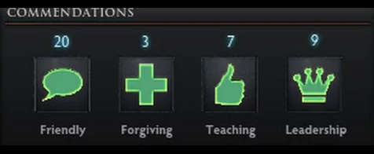
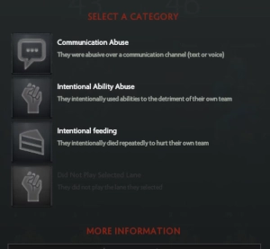

# Ain't He Nice?
## Basic idea

Ain't He Nice? is a world of warcraft addon that allows player to recommend or signal other players.
The concept is based of the Dota 2 conduct summary system, which allows you to anonymously vote for players you've played with.
This project has 2 main goals. From a global approch, I hope this will better the communtity by showing nice players they are appreciated, and toxic ones that they need to change their behavior. And from single-players point of vue, the addon would give you an idea of who you might like to play with, allowing you to build groups based not only on skill (as we currently see with Raider.IO) but also on sociability.

## Inspiration

The original Dota 2 recommandation system and the reporting one:

